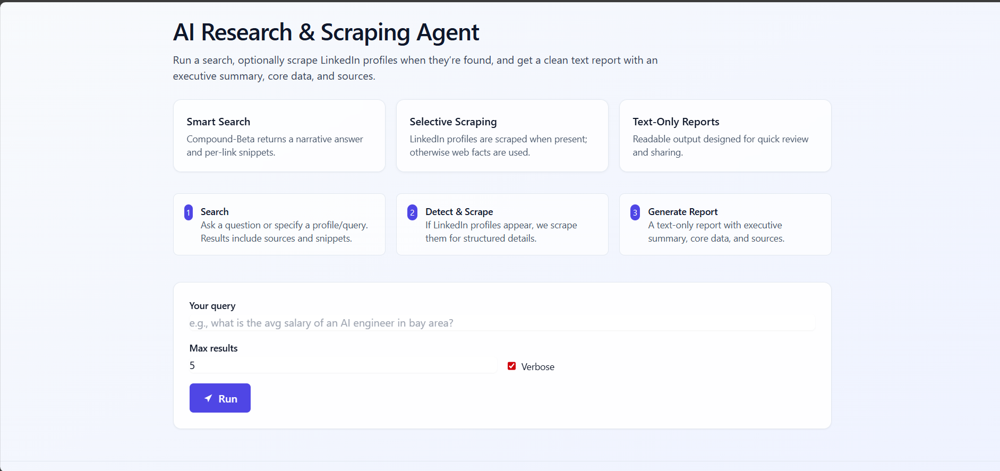

# Manus Clone

Manus Clone is a Python-based tool for automated web research and LinkedIn profile scraping. It uses an LLM for query analysis, performs web searches, and extracts detailed LinkedIn profile and post data using Playwright. Results are compiled into structured, text-only reports.



## How It Works

- Classifies queries and routes LinkedIn profile requests to a Playwright-powered scraper.
- Scrapes profile details and recent posts from LinkedIn.
- Aggregates and analyzes data using an LLM.
- Outputs clean reports and raw data files.

## APIs & Technologies

- Python 3.12+
- Playwright (browser automation)
- Groq API (LLM)
- FastAPI (web UI)
- Pandas (data processing)
- Jinja2 (templating)

## Usage

```bash
python main.py -i "Find software engineers in San Francisco"
python scrapers/linkedin_scraper.py [linkedin_profile_url]
```

## MIT License

This project is licensed under the MIT License.